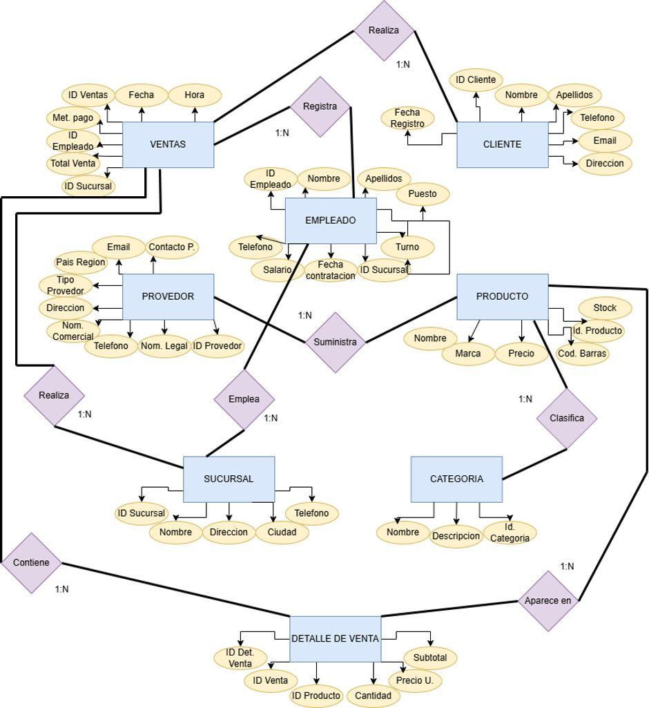
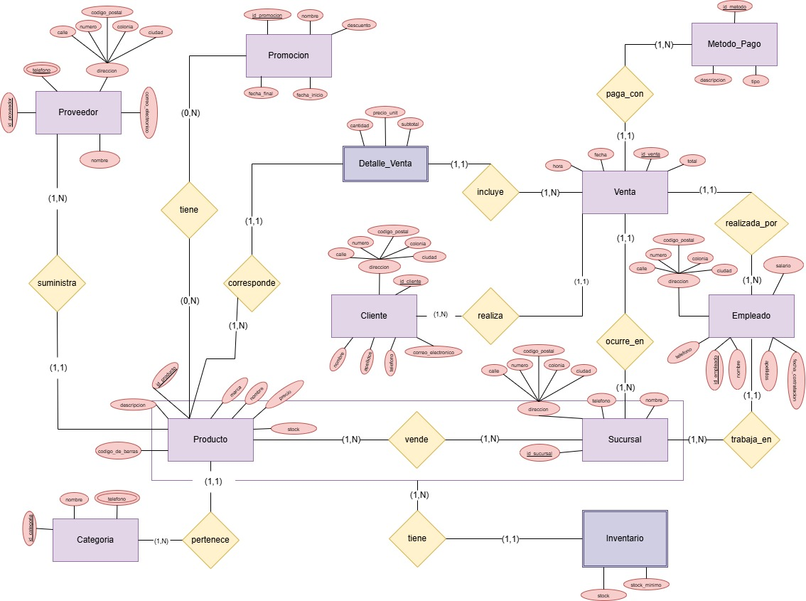
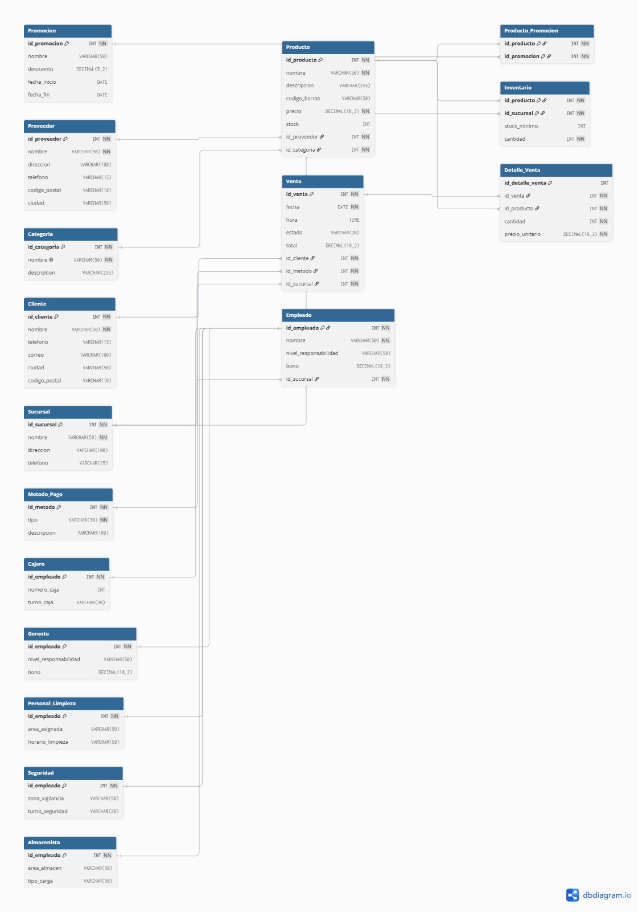
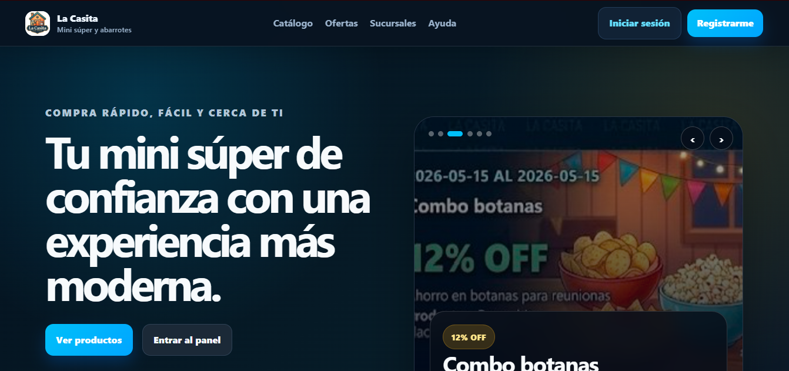
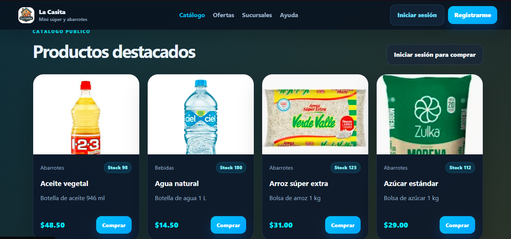
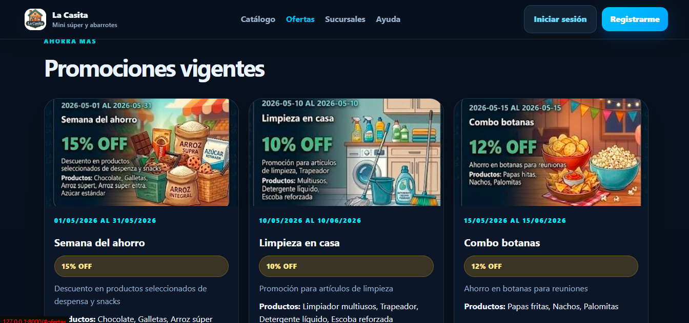
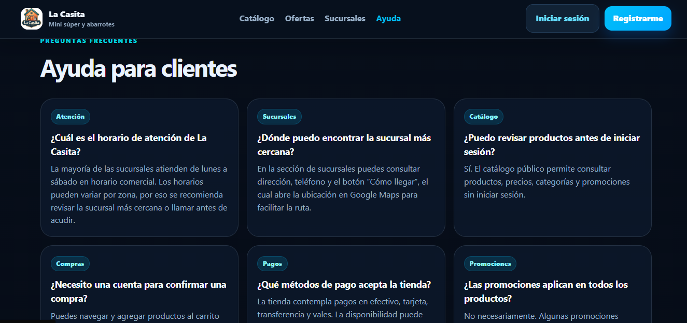
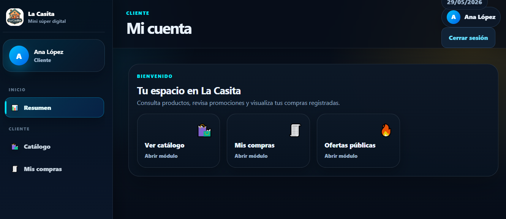

# La Casita - Sistema Web para Mini Súper

## Descripción general

**La Casita** es un sistema web desarrollado para la administración básica de un mini súper. El proyecto integra el diseño de una base de datos relacional con una aplicación web funcional desarrollada en **Laravel**.

El sistema permite gestionar la información principal del negocio, como productos, categorías, clientes, empleados, proveedores, sucursales, inventario, promociones, ventas y preguntas frecuentes. También incluye autenticación de usuarios y control de acceso por roles, permitiendo que cada tipo de usuario tenga acceso únicamente a las secciones correspondientes.

El desarrollo del proyecto se realizó de forma progresiva a partir de las prácticas de la materia de Base de Datos. Primero se trabajó el análisis del caso de estudio, después el diseño de los modelos de datos y finalmente la implementación del sistema web conectado a MySQL. Posteriormente, el proyecto fue dockerizado para facilitar su ejecución local y preparar su despliegue en un entorno compatible con contenedores.

---

## Objetivo general

Desarrollar una aplicación web para un mini súper que permita administrar productos, ventas, inventario, usuarios y demás información operativa, utilizando una base de datos relacional diseñada a partir de modelos conceptuales y relacionales.

---

## Objetivos específicos

* Analizar el caso de estudio del mini súper y definir sus necesidades principales.
* Identificar las entidades, atributos y relaciones del sistema.
* Diseñar el modelo Entidad-Relación.
* Complementar el diseño mediante el modelo Entidad-Relación Extendido.
* Transformar el modelo conceptual en un modelo relacional.
* Implementar la base de datos en MySQL.
* Desarrollar una aplicación web en Laravel conectada a la base de datos.
* Implementar autenticación, sesiones y roles de usuario.
* Crear módulos administrativos para la gestión de información.
* Dockerizar el proyecto para simplificar su ejecución.

---

## Alcance del sistema

El sistema contempla la administración de la información principal de un mini súper. Permite registrar, consultar, modificar y eliminar datos relacionados con productos, categorías, proveedores, sucursales, clientes, empleados, promociones, inventario y ventas.

También incluye un panel diferenciado para cada tipo de usuario:

* Administrador
* Empleado
* Cliente

El sistema está diseñado como un proyecto académico funcional, por lo que permite demostrar el uso de una base de datos relacional dentro de una aplicación web real.

---

## Tecnologías utilizadas

| Tecnología     | Uso dentro del proyecto                                    |
| -------------- | ---------------------------------------------------------- |
| Laravel        | Framework principal para el desarrollo web.                |
| PHP            | Lenguaje utilizado por Laravel para la lógica del sistema. |
| MySQL          | Sistema gestor de base de datos.                           |
| Blade          | Motor de plantillas utilizado para las vistas.             |
| HTML           | Estructura de las páginas web.                             |
| CSS            | Estilos y diseño visual de la aplicación.                  |
| JavaScript     | Funcionalidades básicas del lado del cliente.              |
| Composer       | Gestión de dependencias de PHP.                            |
| Docker         | Contenedorización del proyecto.                            |
| Docker Compose | Ejecución de Laravel, MySQL y phpMyAdmin.                  |
| phpMyAdmin     | Administración visual de la base de datos.                 |
| GitHub         | Control de versiones y almacenamiento del proyecto.        |

---

## Prácticas integradas

<details>
<summary>📚 Ver descripción de las prácticas</summary>

## Práctica 1 - Análisis del caso de estudio

En esta etapa se realizó el análisis inicial del sistema. Se definió el contexto del mini súper, los usuarios involucrados y las operaciones principales que debía cubrir el proyecto.

Se identificaron las necesidades básicas del negocio, como el manejo de productos, clientes, empleados, proveedores, sucursales, ventas e inventario.

### Puntos principales

* Definición del caso de estudio.
* Identificación de usuarios del sistema.
* Análisis de procesos principales.
* Identificación inicial de entidades.
* Definición del propósito general del sistema.
* Reconocimiento de la información que debía almacenarse en la base de datos.

### Resultado de la práctica

Se obtuvo una idea clara del sistema a desarrollar y de los datos que serían necesarios para representar correctamente el funcionamiento del mini súper.

---

## Práctica 2 - Modelo Entidad-Relación

En esta práctica se diseñó el modelo Entidad-Relación, donde se representaron las entidades principales del sistema, sus atributos y las relaciones entre ellas.

Este modelo permitió visualizar de forma conceptual cómo se organiza la información antes de llevarla a tablas.

### Puntos principales

* Identificación de entidades.
* Definición de atributos.
* Selección de atributos clave.
* Identificación de relaciones.
* Definición de cardinalidades.
* Representación gráfica del modelo.

### Entidades consideradas

Algunas de las entidades principales del sistema son:

* Usuario
* Cliente
* Empleado
* Puesto
* Sucursal
* Categoría
* Proveedor
* Producto
* Inventario
* Promoción
* Venta
* Detalle de venta
* Método de pago
* Pregunta frecuente

### Resultado de la práctica

Se obtuvo el primer diseño conceptual de la base de datos, el cual sirvió como base para continuar con el modelo extendido y posteriormente con el modelo relacional.

---

## Práctica 3 - Modelo Entidad-Relación Extendido

En esta práctica se revisó y complementó el modelo Entidad-Relación para representar de manera más completa la estructura del sistema.

El modelo Entidad-Relación Extendido permitió mejorar la organización de los datos y representar de forma más clara algunos elementos del sistema, como los diferentes tipos de usuarios y la relación entre empleados, clientes y usuarios de acceso.

### Puntos principales

* Revisión del modelo ER inicial.
* Ajuste de entidades y relaciones.
* Análisis de posibles generalizaciones o especializaciones.
* Mejora en la representación de usuarios del sistema.
* Preparación del diseño para su transformación a tablas.

### Resultado de la práctica

Se obtuvo una versión más completa del modelo conceptual, con una estructura más adecuada para pasar al modelo relacional.

---

## Práctica 4 - Modelo Relacional

A partir del modelo conceptual se realizó la transformación al modelo relacional. En esta etapa se definieron las tablas de la base de datos, sus llaves primarias, llaves foráneas y relaciones.

El modelo relacional permitió establecer la estructura que posteriormente sería implementada en MySQL.

### Puntos principales

* Conversión de entidades a tablas.
* Conversión de relaciones a llaves foráneas.
* Definición de llaves primarias.
* Definición de restricciones.
* Representación de relaciones uno a muchos.
* Representación de relaciones muchos a muchos mediante tablas intermedias.
* Organización de la estructura final de la base de datos.

### Tablas principales

Algunas tablas consideradas dentro del modelo relacional son:

* `usuario`
* `cliente`
* `empleado`
* `puesto`
* `sucursal`
* `categoria`
* `proveedor`
* `producto`
* `inventario`
* `metodo_pago`
* `promocion`
* `producto_promocion`
* `venta`
* `detalle_venta`
* `faq`

### Resultado de la práctica

Se obtuvo la estructura relacional de la base de datos, la cual sirvió como guía para la implementación física en MySQL.

---

## Práctica 5 - Implementación de la base de datos

En esta práctica se implementó la base de datos a partir del modelo relacional. Se crearon las tablas necesarias, se definieron sus relaciones y se insertaron datos iniciales para realizar pruebas.

En el proyecto final, esta implementación se integró mediante migraciones y seeders de Laravel, lo que permite crear la base de datos automáticamente al ejecutar el sistema.

### Puntos principales

* Creación de la base de datos.
* Creación de tablas.
* Definición de tipos de datos.
* Definición de llaves primarias.
* Definición de llaves foráneas.
* Inserción de registros iniciales.
* Validación de relaciones.
* Preparación de datos de prueba.

### Resultado de la práctica

Se obtuvo una base de datos funcional, con relaciones entre tablas y datos iniciales para probar el sistema.

---

## Práctica 6 - Desarrollo y conexión del sistema web

En esta práctica se desarrolló el sistema web utilizando Laravel. Se conectó la aplicación con la base de datos y se crearon módulos para administrar la información del mini súper.

Además, se integró la autenticación de usuarios, el manejo de sesiones y el control de acceso por roles.

### Puntos principales

* Desarrollo del proyecto en Laravel.
* Conexión con MySQL.
* Uso de migraciones.
* Uso de seeders.
* Creación de modelos.
* Creación de controladores.
* Creación de vistas con Blade.
* Implementación de login y registro.
* Implementación de roles.
* Desarrollo de módulos CRUD.
* Dockerización del proyecto.

### Resultado de la práctica

Se obtuvo una aplicación web funcional conectada a una base de datos relacional, con módulos administrativos, roles de usuario y ejecución mediante Docker.

</details>

---

## Reglas de negocio consideradas

El sistema se diseñó tomando en cuenta las siguientes reglas de negocio:

* Un usuario puede iniciar sesión en el sistema con un rol específico.
* Un cliente puede registrarse y consultar productos disponibles.
* Un empleado pertenece a una sucursal y puede realizar operaciones dentro del sistema.
* Un producto pertenece a una categoría.
* Un producto puede estar asociado a un proveedor.
* El inventario permite conocer la existencia de productos por sucursal.
* Una venta puede contener uno o varios productos.
* Cada venta tiene un detalle de venta con productos, cantidades y subtotales.
* Una venta se asocia con un método de pago.
* Una promoción puede aplicarse a uno o varios productos.
* Un producto puede estar en varias promociones mediante una tabla intermedia.
* El administrador tiene acceso completo a la información del sistema.
* El empleado tiene acceso a funciones operativas.
* El cliente tiene acceso a catálogo e historial de compras.

---

## Modelos de la base de datos

<details>
<summary>📌 Modelo Entidad-Relación</summary>



</details>

---

<details>
<summary>📌 Modelo Entidad-Relación Extendido</summary>




</details>

---

<details>
<summary>📌 Modelo Relacional</summary>




</details>

---

## Estructura de la base de datos

<details>
<summary>🗄️ Ver tablas principales</summary>

### Tabla `usuario`

Almacena los datos de acceso al sistema, como nombre, correo, contraseña y rol.

### Tabla `cliente`

Almacena la información de los clientes registrados en el sistema.

### Tabla `empleado`

Almacena la información de los empleados que participan en la operación del mini súper.

### Tabla `puesto`

Define los puestos que pueden tener los empleados dentro del negocio.

### Tabla `sucursal`

Almacena la información de las sucursales del mini súper.

### Tabla `categoria`

Organiza los productos por tipo o clasificación.

### Tabla `proveedor`

Almacena la información de los proveedores de productos.

### Tabla `producto`

Contiene los datos principales de los productos, como nombre, descripción, precio y categoría.

### Tabla `inventario`

Relaciona productos con sucursales y permite controlar las existencias.

### Tabla `metodo_pago`

Contiene los métodos de pago disponibles para las ventas.

### Tabla `promocion`

Registra las promociones disponibles en el sistema.

### Tabla `producto_promocion`

Tabla intermedia que permite relacionar productos con promociones.

### Tabla `venta`

Almacena la información general de una venta realizada.

### Tabla `detalle_venta`

Guarda los productos incluidos en cada venta, junto con cantidades y subtotales.

### Tabla `faq`

Contiene preguntas frecuentes que se muestran dentro del sistema.

</details>

---

## Funcionalidades del sistema

<details>
<summary>⚙️ Ver funcionalidades por módulo</summary>

## Módulo público

Permite mostrar información general del mini súper.

Incluye:

* Página de inicio.
* Sección de catálogo.
* Promociones.
* Sucursales.
* Ayuda o preguntas frecuentes.

---

## Módulo de autenticación

Permite el acceso de usuarios registrados al sistema.

Incluye:

* Registro de clientes.
* Inicio de sesión.
* Cierre de sesión.
* Validación de credenciales.
* Manejo de sesiones.

---

## Panel de administrador

El administrador puede gestionar la mayor parte de la información del sistema.

Incluye:

* Productos.
* Categorías.
* Clientes.
* Empleados.
* Proveedores.
* Sucursales.
* Promociones.
* Preguntas frecuentes.
* Inventario.
* Ventas.

---

## Panel de empleado

El empleado cuenta con acceso a funciones operativas.

Incluye:

* Consulta de productos.
* Consulta de inventario.
* Consulta de ventas.
* Operaciones básicas relacionadas con el mini súper.

---

## Panel de cliente

El cliente puede consultar información relacionada con productos y compras.

Incluye:

* Consulta de catálogo.
* Visualización de promociones.
* Historial de compras.
* Acceso a su panel personal.

</details>

---

## Roles del sistema

| Rol           | Descripción                                                      |
| ------------- | ---------------------------------------------------------------- |
| Administrador | Tiene acceso completo a los módulos administrativos del sistema. |
| Empleado      | Puede consultar y gestionar información operativa.               |
| Cliente       | Puede consultar el catálogo y revisar sus compras.               |

---

## Cuentas de prueba

| Rol           | Correo                                                | Contraseña |
| ------------- | ----------------------------------------------------- | ---------- |
| Administrador | [admin@lacasita.com](mailto:admin@lacasita.com)       | 123456     |
| Empleado      | [empleado@lacasita.com](mailto:empleado@lacasita.com) | 123456     |
| Cliente       | [cliente@lacasita.com](mailto:cliente@lacasita.com)   | 123456     |

---

## Capturas del sistema

<details>
<summary>🖼️ Ver capturas de pantalla</summary>

### Página de inicio



---

### Catálogo de productos



---

### Promociones



---

### Sucursales


---

### Página de ayuda



---

### Panel de administrador


---

### Panel de empleado


---

### Panel de cliente



</details>

---

## Estructura general del proyecto

```txt
LaCasita/
├── app/
├── bootstrap/
├── capturas/
├── config/
├── database/
│   ├── migrations/
│   └── seeders/
├── docker/
├── public/
├── resources/
│   └── views/
├── routes/
│   └── web.php
├── storage/
├── tests/
├── Dockerfile
├── docker-compose.yml
├── composer.json
├── composer.lock
├── package.json
├── artisan
└── README.md
```

---

## Archivos importantes del proyecto

| Archivo o carpeta       | Descripción                                                          |
| ----------------------- | -------------------------------------------------------------------- |
| `app/`                  | Contiene la lógica principal de Laravel.                             |
| `app/Models/`           | Contiene los modelos que representan las tablas de la base de datos. |
| `app/Http/Controllers/` | Contiene los controladores del sistema.                              |
| `database/migrations/`  | Contiene las migraciones para crear las tablas.                      |
| `database/seeders/`     | Contiene datos iniciales de prueba.                                  |
| `resources/views/`      | Contiene las vistas Blade del sistema.                               |
| `routes/web.php`        | Contiene las rutas principales de la aplicación.                     |
| `public/`               | Contiene archivos públicos como imágenes, CSS y JavaScript.          |
| `Dockerfile`            | Define la imagen de Docker para Laravel.                             |
| `docker-compose.yml`    | Levanta los servicios de Laravel, MySQL y phpMyAdmin.                |
| `.env.example`          | Plantilla de configuración general.                                  |
| `.env.docker.example`   | Plantilla de configuración para Docker.                              |

---

## Ejecución del proyecto con Docker

Para ejecutar el proyecto se requiere tener instalado Docker Desktop.

### 1. Clonar el repositorio

```bash
git clone URL_DEL_REPOSITORIO
cd LaCasita
```

### 2. Construir y levantar los contenedores

```bash
docker compose up --build
```

### 3. Abrir la aplicación

```txt
http://localhost:8000
```

### 4. Abrir phpMyAdmin

```txt
http://localhost:8081
```

Datos de acceso para phpMyAdmin:

```txt
Servidor: mysql
Usuario: lacasita_user
Contraseña: lacasita_pass
```

También se puede ingresar con:

```txt
Usuario: root
Contraseña: root
```

---

## Comandos útiles

Detener los contenedores:

```bash
docker compose down
```

Detener los contenedores y borrar el volumen local de la base de datos:

```bash
docker compose down -v
```

Construir nuevamente el proyecto:

```bash
docker compose up --build
```

Ver contenedores activos:

```bash
docker compose ps
```

Ver logs de la aplicación:

```bash
docker compose logs app
```

Ver logs de MySQL:

```bash
docker compose logs mysql
```

Ejecutar migraciones y seeders:

```bash
docker compose exec app php artisan migrate:fresh --seed
```

Limpiar caché de Laravel:

```bash
docker compose exec app php artisan optimize:clear
```

---

## Seguridad implementada

El sistema incluye medidas básicas de seguridad propias de una aplicación web con Laravel:

* Autenticación de usuarios.
* Contraseñas cifradas.
* Manejo de sesiones.
* Protección de rutas privadas.
* Control de acceso por roles.
* Protección CSRF en formularios.
* Validaciones del lado del servidor.
* Uso de Eloquent ORM para trabajar con la base de datos.

---

## Archivos que no se deben subir al repositorio

No se subieron los siguientes archivos o carpetas:

```txt
.env
vendor/
node_modules/
```

Estos archivos se generan o configuran localmente y no deben formar parte del repositorio.

---

## Estado del proyecto

El proyecto cuenta con una implementación funcional en Laravel conectada a una base de datos MySQL. Se integraron migraciones, seeders, autenticación, roles de usuario y vistas para los diferentes paneles del sistema.

También se agregó Docker para facilitar la ejecución del proyecto sin depender de una instalación manual de Apache, MySQL o XAMPP.

---

## Conclusión

El proyecto **La Casita** integra el proceso completo de análisis, diseño e implementación de una base de datos relacional dentro de una aplicación web funcional.

A lo largo de las prácticas se trabajó desde la identificación de entidades y relaciones hasta la implementación de la base de datos y su conexión con Laravel. La dockerización permite ejecutar el sistema de forma más sencilla y uniforme, manteniendo juntos los servicios necesarios para el funcionamiento del proyecto.


## Enlace del proyecto desplegado

La aplicación se encuentra disponible en: [https://lacasita-production-560a.up.railway.app](https://lacasita-production-560a.up.railway.app)


**Versión estática en GitHub Pages:** 
[La Casita estática](https://dvd-bd.github.io/LaCasita/)
